# FoodPigeoN
<h1>Introduction</h1>

‘FoodPigeoN’ is a ASP.NET CORE MVC (.NET 5) based web application written in C# language. 
The main goal of this project is to sell a restaurant food online and deliver them to their home.
This was my CSE3100 Web Lab Project. 

 

<h2>Flow Chart</h2>

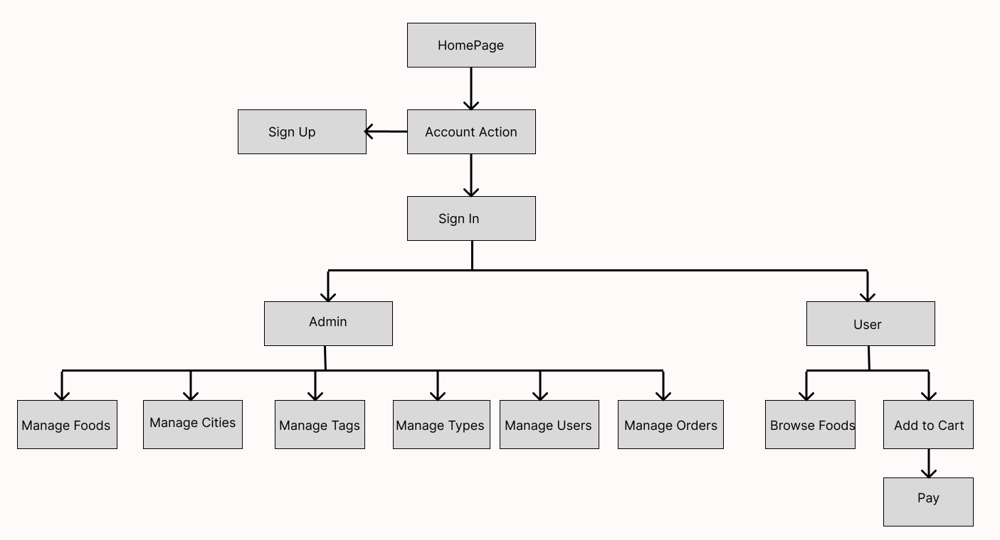

<h2>Home Page</h2>

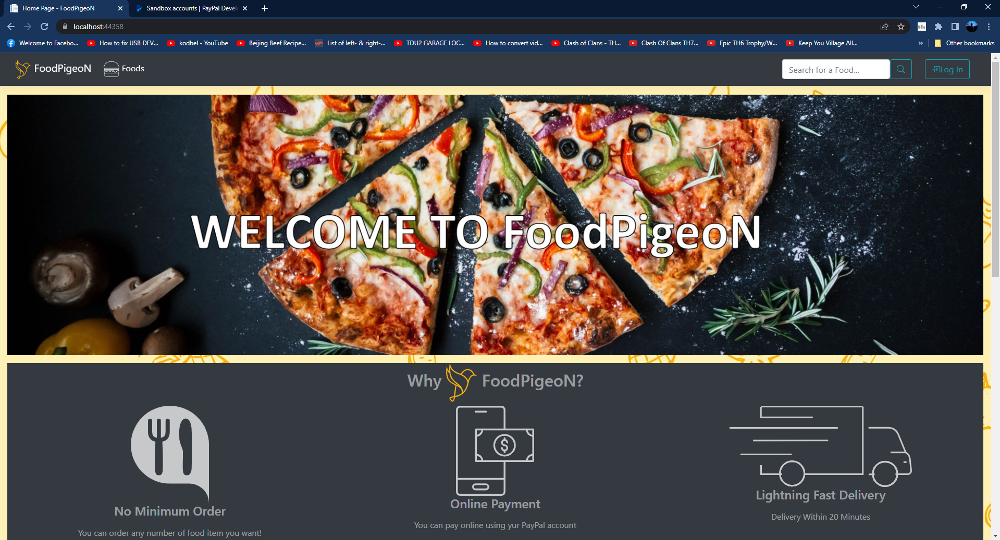

<h2>Browse Food</h2>

<h2>Food Details</h2>

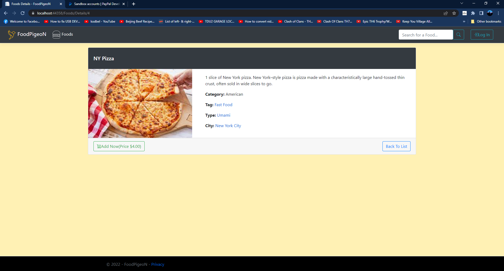

<h2>Shopping Cart</h2>

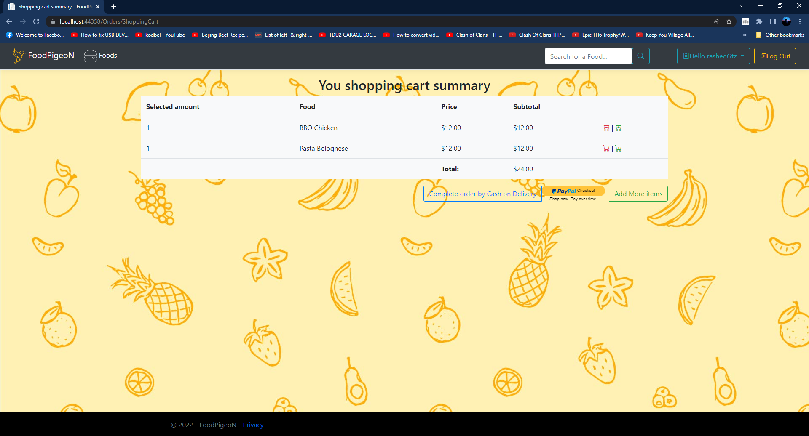

<h2>PayPal Payment</h2>

<h2>Order Complete</h2>

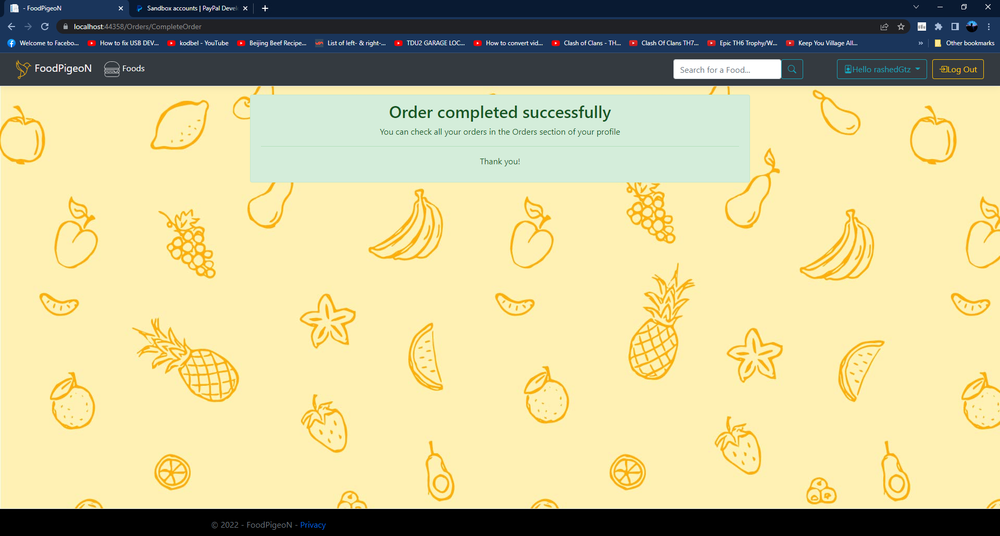

<h2>Food Browser(Admin)</h2>

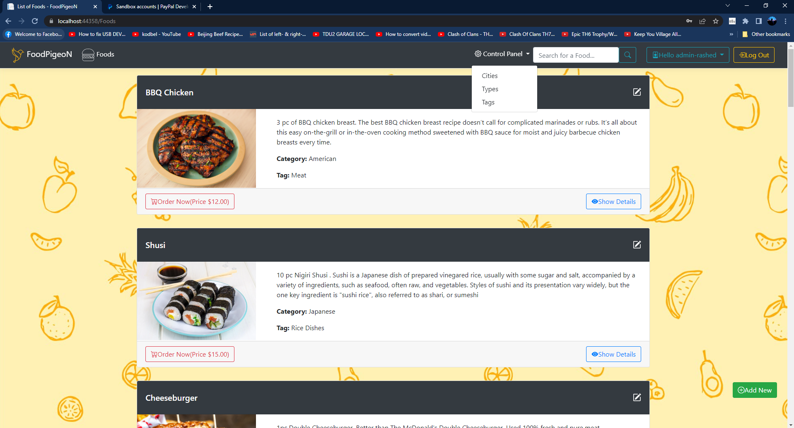

<h2>Adding New Food Item(Admin)</h2>

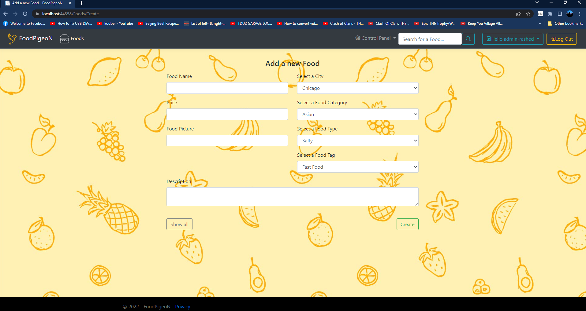

<h2>Updating Current Food Item(Admin)</h2>

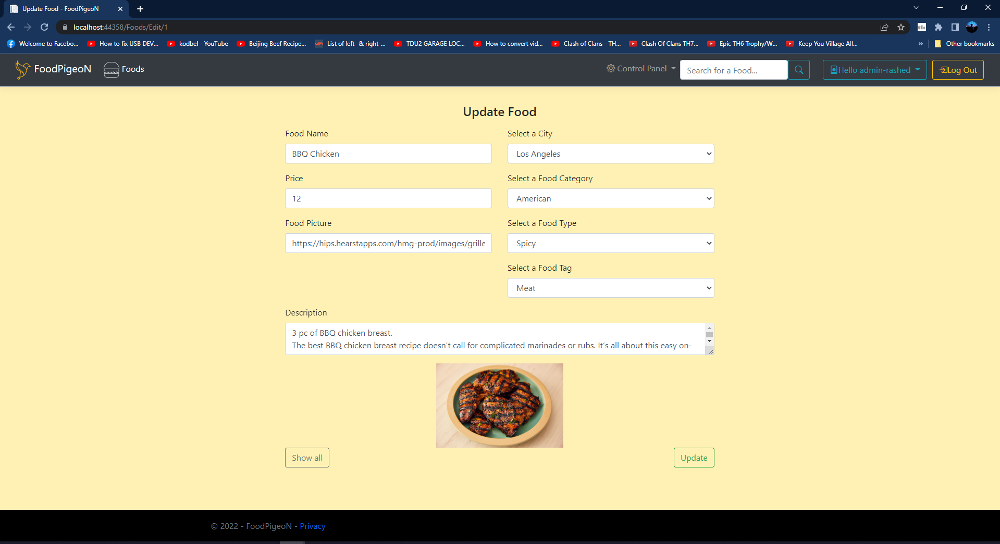

<h2>City List(Admin)</h2>

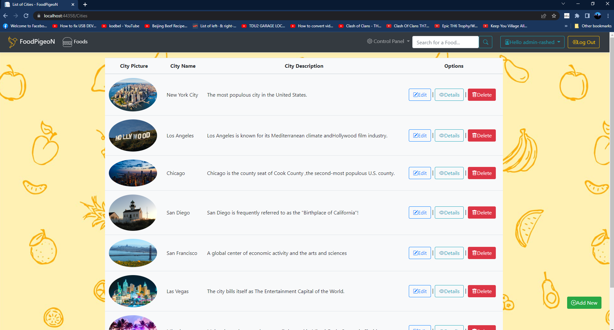

<h2>Tag List(Admin)</h2>

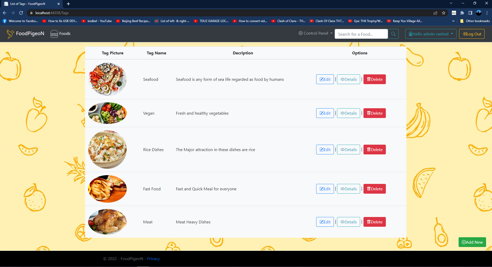

<h2>Type List(Admin)</h2>

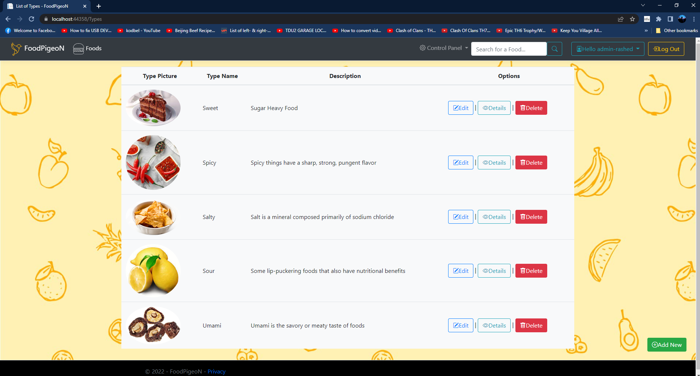

<h2>List of All User(Admin)</h2>

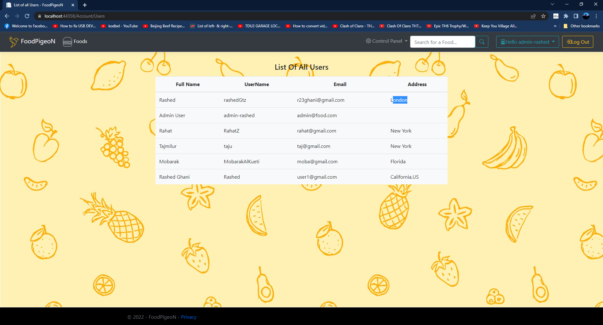

<h2>List of All Orders(Admin)</h2>

